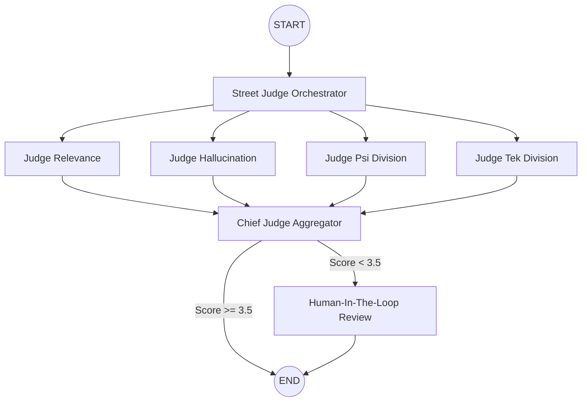

<p align="center">
    
</p>

# ⚖️ JudgeThreadd: Agentic Evaluation Pipeline

**An LLM-as-a-Judge Observability Tool to catch unreliable AI before it goes live.**

An untested RAG system deployed to production can lead to "silent failures" where the AI hallucinates incorrect return policies, breaches brand safety, or provides bad financial advice, damaging user trust and incurring significant liability.

Well, not on JudgeThreadd's watch.

JudgeThreadd is a continuous integration testing tool built to evaluate LLM agents before they reach production. It utilizes a highly parallelized "Council of Judges" to execute the law, ensuring your generative applications are safe, grounded, and technically accurate.

## ⚡ Quick Start

Install the [Taskfile CLI](https://taskfile.dev/installation/) first:

```bash
npm install -g @go-task/cli
```

Then:

```bash
cp .env.example .env      # fill in your API keys (see env vars below)
task install              # install Python + frontend dependencies
task init-db              # one-time setup: creates Qdrant collection + Supabase tables
task run                  # opens backend (localhost:8000) + frontend (localhost:5173) in separate windows
```

### All Commands

| Command | What it does |
|---|---|
| `task install` | Install Python + frontend dependencies |
| `task run` | Start backend and frontend in separate windows |
| `task backend` | Start just the FastAPI server (`localhost:8000`) |
| `task frontend` | Start just the Vue UI (`localhost:5173`) |
| `task init-db` | One-time setup — creates Qdrant collection and Supabase tables |
| `task generate-dataset` | Generate 20 test cases from the PDF using Gemini |
| `task evaluate` | Run batch evaluation over the golden dataset |
| `task report` | Print analytics dashboard from the latest report |
| `task test-rag` | Smoke-test the RAG pipeline with 3 sample questions |

---

## 🛠️ The Tech Stack

* **Orchestration:** LangGraph (Parallel DAG execution)
* **Backend:** FastAPI (Python, Server-Sent Events/SSE)
* **Frontend:** Vue.js 3 (Tailwind CSS, Vite, Real-time telemetry)
* **Episodic Memory:** Supabase (PostgreSQL with `PostgresSaver`)
* **Semantic Search:** Qdrant Cloud (Vector Database)
* **LLMs:** Groq (Llama 3 70B for the Judges, Llama 3 8B for the baseline agent)

## 🧠 System Architecture

JudgeThreadd accepts a payload (Question, Retrieved Context, Generated Answer) and simultaneously fans out to specialized AI Judges. It streams real-time execution telemetry to the frontend, aggregates the scores, and forces a Human-in-the-Loop review if the AI drifts below acceptable thresholds.



## 🏗️ First-Time Setup: Building the Vector Database

Before running any evaluations, you must ingest the baseline data (e.g., the 'Think Python' manual) into your Qdrant vector database. If you skip this, the agent will throw a `404 Not Found` error.

Run the one-time setup command to create the `portfolio_docs` collection and Supabase tables:

```bash
task init-db
```


### Step 1: Define Your Dataset

To test an agent, you need a baseline of questions.

* Open `data/golden_dataset.json` and observe the format of Python related questions.
* Replace the contents with a JSON array of your own historical user queries and the expected ground-truth contexts.

### Step 2: Modify the "Brain" 

This pipeline evaluates whatever logic exists inside `app/agent/baseline_rag.py`.

To test a change, open that file and modify the variables:

* **Testing a new model:** Locate the LLM initialization and change `model="llama-3.1-8b-instant"` to a different model (e.g., `gemma2-9b-it`).
* **Testing a new prompt:** Update the `prompt_template` string with new instructions to see if the AI adheres to them better.
* **Testing retrieval:** Change the vector database `search_kwargs={"k": 2}` to retrieve more or fewer documents.

### Step 3: Run the Batch Evaluator

Do not type questions one by one into the UI. Instead, run the automated integration test:

```bash
task evaluate
```

## 🖥️ The Grand Hall Telemetry Dashboard (UI)

While the batch runner is for automated testing, the **Grand Hall Dashboard** is a reactive Vue.js interface built for visual, human-in-the-loop debugging of single queries.

### How to Launch the UI

Run both servers at once with:

```bash
task run
```

Or start them individually in separate terminals:

```bash
task backend    # FastAPI server → localhost:8000
task frontend   # Vue UI → localhost:5173
```

3. Add an "Environment Variables" Section
Since your app relies heavily on API keys (Groq, Qdrant), you must explicitly tell users what to put in their `.env` file. Otherwise, the application will crash immediately on launch.

```md
### 3. Environment Variables
Create a `.env` file in the root directory and add the following keys. You will need active accounts with Groq and Qdrant (Cloud or Local).
```

```env
GROQ_API_KEY="gsk_your_groq_api_key"
QDRANT_URL="[https://your-cluster-url.qdrant.tech](https://your-cluster-url.qdrant.tech)" # Or http://localhost:6333 for local
QDRANT_API_KEY="your_qdrant_api_key"
```

4. Open your browser to <http://localhost:5173>.
